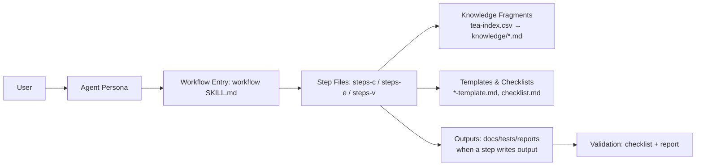

# Test Architect (TEA)

[](https://www.python.org)
[](https://docs.astral.sh/uv/)

TEA (Test Engineering Architect) is a standalone BMAD module that delivers risk-based test strategy, test automation guidance, and release gate decisions. It provides a single expert agent (Murat, Master Test Architect and Quality Advisor) and nine workflows spanning Teach Me Testing (TEA Academy), test design, framework setup, CI guidance, ATDD, automation, test review, NFR Evidence Audit, and traceability.

Docs: <https://bmad-code-org.github.io/bmad-method-test-architecture-enterprise/>

## Why TEA

- Risk-based testing with measurable quality gates
- Consistent, knowledge-base driven outputs
- Clear prioritization (P0-P3) and traceability
- Optional Playwright Utils, CLI, and MCP browser automation

## How BMad Works

BMad works because it turns big, fuzzy work into **repeatable workflows**. Each workflow is broken into small steps with clear instructions, so the AI follows the same path every time. It also uses a **shared knowledge base** (standards and patterns) so outputs are consistent, not random. In short: **structured steps + shared standards = reliable results**.

## How TEA Fits In

TEA plugs into BMad the same way a specialist plugs into a team. It uses the same step‑by‑step workflow engine and shared standards, but focuses exclusively on testing and quality gates. That means you get a **risk‑based test plan**, **automation guidance**, and **go/no‑go decisions** that align with the rest of the BMad process.

## Architecture & Flow

BMad is a small **agent + workflow engine**. There is no external orchestrator — everything runs inside the LLM context window through structured instructions.

### Building Blocks

TEA has two layers of files, and each has a specific job:

| File / Scope                                       | What it does                                                                                         | When it loads                                           |
| -------------------------------------------------- | ---------------------------------------------------------------------------------------------------- | ------------------------------------------------------- |
| `src/agents/bmad-tea/SKILL.md`                     | Murat's persona — identity, principles, critical actions, capabilities table                         | First — activates the TEA agent                         |
| `src/agents/bmad-tea/customize.toml`               | Agent customization surface — menu items, persistent facts, activation hooks                         | During agent activation                                 |
| `src/workflows/testarch/<workflow>/SKILL.md`       | Workflow entrypoint — resolves workflow customization, picks mode, routes to the first step          | When a TEA workflow is invoked                          |
| `src/workflows/testarch/<workflow>/customize.toml` | Workflow customization surface — activation hooks, persistent facts, optional `on_complete` behavior | During workflow activation                              |
| `src/workflows/testarch/<workflow>/workflow.yaml`  | Machine-readable workflow metadata — descriptions, defaults, tool hints, output paths                | Used by installer/tooling and workflow metadata lookups |
| `instructions.md`                                  | Workflow-specific summary and operator notes                                                         | On demand                                               |
| `steps-c/*.md`                                     | **Create** steps — primary execution, 5-9 sequential files                                           | One at a time (just-in-time)                            |
| `steps-e/*.md`                                     | **Edit** steps — always 2 files: assess target, apply edit                                           | One at a time                                           |
| `steps-v/*.md`                                     | **Validate** steps — always 1 file: evaluate against checklist                                       | On demand                                               |
| `checklist.md`                                     | Validation criteria — what "done" looks like for this workflow                                       | Read by steps-v                                         |
| `*-template.md`                                    | Output skeleton with `{PLACEHOLDER}` vars — steps fill these in to produce the final artifact        | Read by steps-c when generating output                  |
| `src/agents/bmad-tea/resources/tea-index.csv`      | Agent-level knowledge fragment index — id, name, tags, tier (core/extended/specialized), file path   | Read by the TEA agent for direct recommendations        |
| `src/workflows/testarch/<workflow>/resources/`     | Workflow-local knowledge index and fragments                                                         | Read by workflow steps from that workflow's skill root  |
| `resources/knowledge/*.md`                         | Reusable fragments — standards, patterns, API references                                             | Selectively read into context based on tier + config    |

Workflow resource directories intentionally duplicate the TEA knowledge base. Each workflow skill must stay self-contained so it can be installed, copied, or invoked without reaching across skill boundaries. When knowledge changes, propagate the intended updates to the affected workflow resource directories instead of replacing them with a central runtime path.



### How It Works at Runtime

1. **Trigger** — Direct commands are `/bmad:tea:automate` (Claude/Cursor/Windsurf) and `$bmad-tea-testarch-automate` (Codex). Load the conversational TEA menu with `$bmad-tea` in Codex. `TA` is an agent-menu trigger available only after TEA is activated; the capabilities table in `SKILL.md` maps `TA` to the `bmad-testarch-automate` skill.
2. **Agent loads** — `SKILL.md` injects the persona (identity, principles, critical actions) into the context window.
3. **Workflow loads** — The workflow's `SKILL.md` becomes the entrypoint. It resolves the workflow block from `customize.toml`, loads persistent facts and config, decides the mode (Create / Edit / Validate), then routes to the first step file.
4. **Step-by-step execution** — Only the current step file is in context (just-in-time loading). Each step explicitly names the next one with a `{skill-root}`-anchored path. The LLM reads, executes, saves output, then loads the next step. No future steps are ever preloaded.
5. **Knowledge injection** — Step-01 reads `tea-index.csv` and selectively loads fragments by **tier** (core = always, extended = on-demand, specialized = only when relevant) and **config flags** (e.g., `tea_use_pactjs_utils`). This is deliberate context engineering: a backend project loads ~1,800 lines of fragments; a fullstack project loads ~4,500 lines. Conditional loading cuts context usage by 40-50%.
6. **Templates** — When a step produces output (e.g., a traceability matrix or test review report), it reads the `*-template.md` file and fills in the `{PLACEHOLDER}` values with computed results. The template provides consistent structure; the step provides the content.
7. **Subagent isolation** — Heavy workflows (e.g., `automate`) spawn parallel subagents that each run in an isolated context. Subagents write structured JSON to temp files. An aggregation step reads the JSON outputs — only the results enter the main context, not the full subagent history.
8. **Progress tracking** — Each step appends to an output file with YAML frontmatter (`stepsCompleted`, `lastStep`, `lastSaved`). Resume mode reads this frontmatter and routes to the next incomplete step.
9. **Validation** — The `steps-v/` mode reads `checklist.md` and evaluates the workflow's output against its criteria, producing a pass/fail validation report.

### Workflows vs Skills

BMad workflows and Claude Code Skills solve different problems at different scales:

| Capability        | Claude Code Skills          | BMad Workflows                                                               |
| ----------------- | --------------------------- | ---------------------------------------------------------------------------- |
| **Execution**     | Single prompt, one shot     | 5-9 sequential steps with explicit handoffs                                  |
| **State**         | Stateless                   | YAML frontmatter tracking (`stepsCompleted`, `lastStep`) with resume         |
| **Knowledge**     | Whatever fits in one prompt | Tiered index (40 fragments), conditional loading by config + stack detection |
| **Context mgmt**  | Everything in one shot      | Just-in-time step loading, subagent isolation (separate contexts)            |
| **Output**        | Freeform                    | Templates with `{PLACEHOLDER}` vars filled by specific steps                 |
| **Validation**    | None                        | Dedicated mode (`steps-v/`) evaluating against checklists                    |
| **Configuration** | None                        | `module.yaml` with prompted config flags driving conditional behavior        |
| **Modes**         | None                        | Create / Edit / Validate — three separate step chains per workflow           |

The key insight is that there is **no external runtime engine** — the LLM _is_ the engine. BMad workflows are structured markdown that the LLM follows as instructions: "read this file, execute it completely, save your output, load the next file." Skills are a single tool in a toolbox; BMad workflows are a workshop with a process manual.

**How workflows become commands.** When you run `npx bmad-method install`, the installer generates tool-specific artifacts for your runtime (for example, Claude Code uses `.claude/commands/`, while Codex uses `.agents/skills/`). Those launchers bridge into the installed TEA agent or workflow package. Once invoked, the workflow's `SKILL.md` is the conversational entrypoint, and the step-file process takes over from there.

```text
.claude/commands/                         # Generated by installer
├── bmad-tea.md                           # /tea → loads agent persona + menu
├── bmad-tea-testarch-automate.md         # /automate → invokes the automate workflow package
├── bmad-tea-testarch-test-design.md      # /test-design → ...
├── bmad-bmm-create-prd.md               # /create-prd → BMM workflow
└── ... (61 commands total across all installed modules)
```

The BMAD-METHOD source repo also has standalone `.claude/skills/` (e.g., `bmad-os-release-module`, `bmad-os-gh-triage`) for its own maintenance workflows. External tools can register skills too (e.g., `playwright-cli install --skills`). The installer supports 10+ platforms: Claude Code, Cursor, GitHub Copilot, Codex, Gemini, Windsurf, Cline, and more.

## Install

```bash
npx bmad-method install
# Select: Test Architect (TEA)
```

**Note:** TEA is automatically added to party mode after installation. Use `/party` to collaborate with TEA alongside other BMad agents.

### Tool-specific invocation

| Tool                            | Invocation style                | Example                                      |
| ------------------------------- | ------------------------------- | -------------------------------------------- |
| Claude Code / Cursor / Windsurf | Slash command                   | `/bmad:tea:automate`                         |
| Codex                           | `$` skill from `.agents/skills` | `$bmad-tea` or `$bmad-tea-testarch-automate` |

## Quickstart

1. Install TEA (above)
2. Load the TEA menu with `$bmad-tea` if you want a conversational entrypoint.
3. Run one of the core workflows:
   - `TD` / `/bmad:tea:test-design` / `$bmad-tea-testarch-test-design` — test design, risk assessment, and NFR planning
   - `AT` / `/bmad:tea:atdd` / `$bmad-tea-testarch-atdd` — failing acceptance tests first (TDD red phase)
   - `TA` / `/bmad:tea:automate` / `$bmad-tea-testarch-automate` — expand automation coverage
4. Or use in party mode: `/party` to include TEA with other agents

## Engagement Models

- **No TEA**: Use your existing testing approach
- **TEA Solo**: Standalone use on non-BMad projects
- **TEA Lite**: Start with `automate` only for fast onboarding
- **Integrated (BMad Method / Enterprise)**: Use TEA in Phases 3–4 and release gates

## Workflows

| Trigger | Slash Command                | Codex Skill                      | Purpose                                                   |
| ------- | ---------------------------- | -------------------------------- | --------------------------------------------------------- |
| TMT     | `/bmad:tea:teach-me-testing` | `$bmad-tea-teach-me-testing`     | Teach Me Testing (TEA Academy)                            |
| TD      | `/bmad:tea:test-design`      | `$bmad-tea-testarch-test-design` | System-level or epic-level test design and NFR planning   |
| TF      | `/bmad:tea:framework`        | `$bmad-tea-testarch-framework`   | Scaffold test framework (frontend, backend, or fullstack) |
| CI      | `/bmad:tea:ci`               | `$bmad-tea-testarch-ci`          | Set up CI/CD quality pipeline (multi-platform)            |
| AT      | `/bmad:tea:atdd`             | `$bmad-tea-testarch-atdd`        | Generate failing acceptance tests + checklist             |
| TA      | `/bmad:tea:automate`         | `$bmad-tea-testarch-automate`    | Expand test automation coverage                           |
| RV      | `/bmad:tea:test-review`      | `$bmad-tea-testarch-test-review` | Review test quality and score                             |
| NR      | `/bmad:tea:nfr-assess`       | `$bmad-tea-testarch-nfr`         | Audit implemented NFR evidence                            |
| TR      | `/bmad:tea:trace`            | `$bmad-tea-testarch-trace`       | Trace requirements to tests + gate decision               |

## Configuration

TEA variables are defined in `src/module.yaml` and prompted during install:

- `test_artifacts` — base output folder for test artifacts
- `tea_use_playwright_utils` — enable Playwright Utils integration (boolean)
- `tea_use_pactjs_utils` — enable Pact.js Utils integration for contract testing when your project explicitly uses Pact (boolean)
- `tea_pact_mcp` — SmartBear MCP for PactFlow/Broker interaction when broker integration is needed: mcp, none (string)
- `tea_browser_automation` — browser automation mode: auto, cli, mcp, none (string)
- `test_framework` — detected or configured test framework (Playwright, Cypress, Jest, Vitest, pytest, JUnit, Go test, dotnet test, RSpec)
- `test_stack_type` — detected or configured stack type (frontend, backend, fullstack)
- `ci_platform` — CI platform (auto, github-actions, gitlab-ci, jenkins, azure-devops, harness, circle-ci)
- `risk_threshold` — risk cutoff for mandatory testing (future)
- `test_design_output`, `test_review_output`, `trace_output` — subfolders under `test_artifacts`

## Knowledge Base

TEA relies on a curated testing knowledge base:

- Index: `src/agents/bmad-tea/resources/tea-index.csv`
- Fragments: `src/agents/bmad-tea/resources/knowledge/`

Workflows load only the fragments required for the current task to stay focused and compliant.

## Module Structure

```
src/
├── module.yaml
├── agents/
│   └── bmad-tea/
│       ├── SKILL.md
│       ├── customize.toml
│       └── resources/
│           ├── tea-index.csv
│           └── knowledge/
├── workflows/
│   └── testarch/
│       ├── bmad-teach-me-testing/
│       ├── bmad-testarch-atdd/
│       ├── bmad-testarch-automate/
│       ├── bmad-testarch-ci/
│       ├── bmad-testarch-framework/
│       ├── bmad-testarch-nfr/
│       ├── bmad-testarch-test-design/
│       ├── bmad-testarch-test-review/
│       └── bmad-testarch-trace/
```

## Extending TEA

Custom workflows are still compatible with TEA, but they are no longer implicitly absorbed into TEA core. The supported path is:

1. Package the workflow as custom content or a custom module.
2. Attach it to `bmad-tea` using the agent customization flow.
3. Reinstall/update BMAD so the new menu item and workflow are registered.

See [Extend TEA with Custom Workflows](docs/how-to/customization/extend-tea-with-custom-workflows.md) and the BMAD customization guide at [`BMAD-METHOD/docs/how-to/customize-bmad.md`](https://github.com/bmad-code-org/BMAD-METHOD/blob/main/docs/how-to/customize-bmad.md).

## Contributing

See `CONTRIBUTING.md` for guidelines.

---

<details>
<summary><strong>📦 Release Guide (for Maintainers)</strong></summary>

## Publishing TEA to NPM

TEA uses an automated publish workflow modeled after the main `BMAD-METHOD` repo. It supports:

- `next` prereleases published automatically from `main`
- manual stable releases on the `latest` dist-tag
- trusted npm publishing (no `NPM_TOKEN` secret)
- metadata sync for `package.json`, `package-lock.json`, and `.claude-plugin/marketplace.json`

### Prerequisites (One-Time Setup)

1. **npm Trusted Publishing:**
   - In npm package settings for `bmad-method-test-architecture-enterprise`, configure Trusted Publishers for this GitHub repository
   - Allow publishes from the `bmad-code-org/bmad-method-test-architecture-enterprise` repo and the `.github/workflows/publish.yaml` workflow
   - GitHub Actions must be able to request an OIDC token (`id-token: write`), which the workflow already does

2. **GitHub App Secrets for Stable Releases:**
   - Add `RELEASE_APP_ID`
   - Add `RELEASE_APP_PRIVATE_KEY`
   - Install the corresponding GitHub App on this repository with contents write access
   - If `main` is protected, ensure the app is allowed to push the release commit and tag
   - These are used only for manual stable releases so the workflow can push the version bump commit and tag back to `main`

3. **Verify Package Configuration:**
   ```bash
   # Check package.json settings
   cat package.json | grep -A 3 "publishConfig"
   # Should show: "access": "public"
   if grep -Eq '"private"[[:space:]]*:[[:space:]]*true' package.json; then
     echo '❌ package.json must not set "private": true'
   else
     echo '✅ package.json is publishable ("private": true not present)'
   fi
   ```

### Release Process

#### Option 1: Using npm Scripts (Recommended)

From your local terminal after merging to `main`:

```bash
# Publish the next prerelease from current main
npm run release:next

# Publish a stable patch release
npm run release:patch

# Publish a stable minor release
npm run release:minor

# Publish a stable major release
npm run release:major
```

#### Option 2: Manual Workflow Trigger

1. Go to **Actions** tab in GitHub
2. Click **"Publish"** workflow
3. Click **"Run workflow"**
4. Choose the branch to release, typically `main`
5. Select channel:
   - `next` for a prerelease publish
   - `latest` for a stable release
6. If using `latest`, choose the bump type (`patch`, `minor`, `major`)
7. Click **"Run workflow"**

### What Happens Automatically

The workflow performs these steps:

1. ✅ **Validation**: Runs the full `npm test` suite, including schema checks, install tests, knowledge checks, linting, markdown linting, formatting, and release metadata validation
2. ✅ **Version Bump**:
   - `next`: derives the next prerelease version and publishes it with dist-tag `next`
   - `latest`: bumps the stable version (`patch`, `minor`, or `major`)
3. ✅ **Metadata Sync**: Updates `.claude-plugin/marketplace.json` to match the package version before publishing
4. ✅ **Publish**: Publishes to npm with provenance enabled
   - `next` → `npm publish --tag next --provenance`
   - `latest` → `npm publish --tag latest --provenance`
5. ✅ **Stable Release Finalization**: For `latest`, creates a version bump commit, tags it, pushes it to `main`, and creates a GitHub Release

### Channel Strategy

- **`next`**: prerelease channel for the newest merged changes
- **`latest`**: stable channel for intentional releases
- **`patch`**: bug fixes, no breaking changes
- **`minor`**: new features, backwards compatible
- **`major`**: breaking changes

**Recommended Release Path:**

1. Merge releasable work to `main`
2. Let `next` publish for early validation
3. When ready, cut a stable `latest` release via `patch`, `minor`, or `major`

### Verify Publication

**Check NPM:**

```bash
npm view bmad-method-test-architecture-enterprise
npm view bmad-method-test-architecture-enterprise dist-tags
```

**Install TEA:**

```bash
npx bmad-method install
# Select "Test Architect (TEA)"
```

**Test Workflows:**

```bash
# In your project
tea              # Load agent
test-design      # Test workflow
```

### Rollback a Release (if needed)

If you need to unpublish a version:

```bash
# Unpublish specific version (within 72 hours)
npm unpublish bmad-method-test-architecture-enterprise@1.13.2-next.0

# Deprecate version (preferred for older releases)
npm deprecate bmad-method-test-architecture-enterprise@1.13.2-next.0 "Use version X.Y.Z instead"
```

### Troubleshooting

**Trusted publishing failed:**

- Verify npm Trusted Publishing is configured for this repository and workflow
- Verify the workflow has `id-token: write`
- Confirm the publish is running from the canonical repository, not a fork

**"Package already exists":**

- Check if package name is already taken on NPM
- Update `name` in `package.json` if needed

**"Version push failed":**

- Verify `RELEASE_APP_ID` and `RELEASE_APP_PRIVATE_KEY` are configured
- Verify the GitHub App is installed on this repository with contents write access
- If branch protection is enabled on `main`, verify the app is allowed to push the release commit and tag

**"Tests failed":**

- Fix failing tests before release
- Run `npm test` locally to verify

**"Git push failed (protected branch)":**

- This is not expected once the release GitHub App is configured correctly
- Verify branch protection allows the app to push the release commit and tag
- If needed, create the GitHub Release manually after resolving the app permissions

### Release Checklist

Before releasing:

- [ ] All tests passing: `npm test`
- [ ] Documentation up to date
- [ ] CHANGELOG.md updated
- [ ] No uncommitted changes
- [ ] On `main` branch
- [ ] npm Trusted Publishing configured
- [ ] `RELEASE_APP_ID` and `RELEASE_APP_PRIVATE_KEY` configured
- [ ] Package name available on NPM

After releasing:

- [ ] Verify NPM publication: `npm view bmad-method-test-architecture-enterprise`
- [ ] Test installation: `npx bmad-method install`
- [ ] Verify workflows work
- [ ] Check GitHub Release created
- [ ] Monitor for issues

</details>

---

## Community

- [Discord](https://discord.gg/gk8jAdXWmj) — Get help, share ideas, collaborate
- [YouTube](https://youtube.com/@BMadCode) — Tutorials, master class, and more
- [X / Twitter](https://x.com/BMadCode)
- [Website](https://bmadcode.com)

## Support BMad

BMad is free for everyone and always will be. Star this repo, [buy me a coffee](https://buymeacoffee.com/bmad), or email [contact@bmadcode.com](mailto:contact@bmadcode.com) for corporate sponsorship.

## License

See `LICENSE`.
