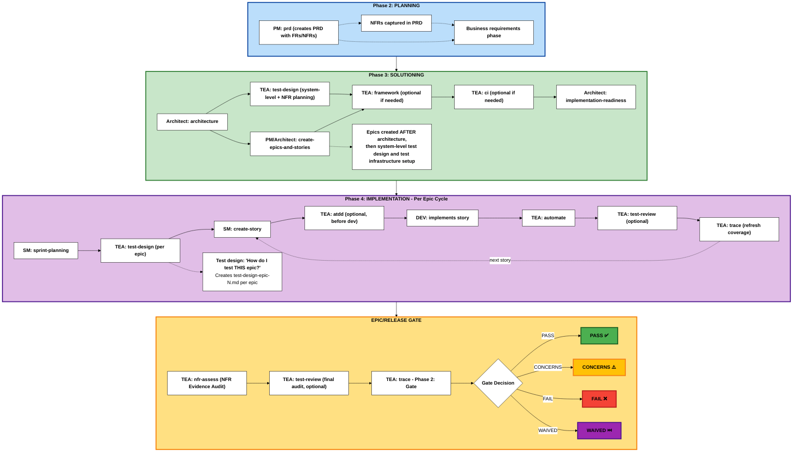

The Test Architect (TEA) is a specialized agent focused on quality strategy, test automation, and release gates in BMad Method projects.

:::tip[Design Philosophy]
TEA was built to solve AI-generated tests that rot in review. For the problem statement and design principles, see [Testing as Engineering](/docs/explanation/testing-as-engineering.md). For setup, see [Setup Test Framework](/docs/how-to/workflows/setup-test-framework.md).
:::

## Overview

- **Persona:** Murat, Master Test Architect and Quality Advisor focused on risk-based testing, fixture architecture, ATDD, and CI/CD governance.
- **Mission:** Deliver actionable quality strategies, automation coverage, and gate decisions that scale with project complexity and compliance demands.
- **Use When:** BMad Method or Enterprise track projects, integration risk is non-trivial, brownfield regression risk exists, or compliance/NFR evidence is required. (Quick Flow projects typically don't require TEA)

## Choose Your TEA Engagement Model

BMad does not mandate TEA. There are five valid ways to use it (or skip it). Pick one intentionally.

1. **No TEA**
   - Skip all TEA workflows. Use your existing team testing approach.

2. **TEA Solo (Standalone)**
   - Use TEA on a non-BMad project. Bring your own requirements, specs, system-of-record pointers, or analyzable source tree, plus environments.
   - Typical sequence: `test-design` (system or epic) -> `atdd` and/or `automate` -> optional `test-review` -> `trace` for coverage and gate decisions.
   - Run `framework` or `ci` only if you want TEA to scaffold the harness or pipeline; they work best after you decide the stack/architecture.

**TEA Lite (Beginner Approach):**

- Simplest way to use TEA - just use `automate` to test existing features.
- Perfect for learning TEA fundamentals in 30 minutes.
- See [TEA Lite Quickstart Tutorial](/docs/tutorials/tea-lite-quickstart.md).

**TEA Academy (Learning Path):**

- Interactive learning companion that teaches testing progressively through 7 structured sessions.
- Perfect for: QAs, developers learning testing, anyone wanting comprehensive testing knowledge.
- **Time:** 1-2 weeks self-paced (30-90 min per session).
- **Features:** State persistence (pause/resume), role-adapted examples (QA/Dev/Lead/VP), quiz validation, completion certificate.
- **Command:** `teach-me-testing` or `TMT` in TEA agent.
- See [Learn Testing with TEA Academy Tutorial](/docs/tutorials/learn-testing-tea-academy.md).

3. **Integrated: Greenfield - BMad Method (Simple/Standard Work)**
   - Phase 3: system-level `test-design`, then `framework` and `ci`.
   - Phase 4: per-epic `test-design`, optional `atdd`, then `automate` and optional `test-review`.
   - Gate (Phase 2): `trace`.

4. **Integrated: Brownfield - BMad Method or Enterprise (Simple or Complex)**
   - Phase 2: baseline `trace`.
   - Phase 3: system-level `test-design`, then `framework` and `ci`.
   - Phase 4: per-epic `test-design` focused on regression and integration risks.
   - Gate: optional `nfr-assess` for NFR Evidence Audit, then `trace` Phase 2.
   - For brownfield BMad Method, run `nfr-assess` only when NFR evidence exists and matters to release.

5. **Integrated: Greenfield - Enterprise Method (Enterprise/Compliance Work)**
   - Phase 2: PM defines NFRs in PRD.
   - Phase 3: system-level `test-design` plans NFR thresholds/evidence, then `framework` and `ci`.
   - Phase 4: per-epic `test-design`, plus `atdd`/`automate`/`test-review`.
   - Gate: `nfr-assess` audits evidence, `trace` Phase 2 makes the gate decision; archive artifacts as needed.

If you are unsure, default to the integrated path for your track and adjust later.

### Exact Phase 3 Commands

When this page says `test-design`, `framework`, or `ci`, those are TEA workflow names. If the TEA agent menu is already active, you can use the menu codes `TD`, `TF`, and `CI`. Otherwise, use the full command form for your tool:

| Phase 3 Step             | Claude Code / Cursor / Windsurf | Codex                            |
| ------------------------ | ------------------------------- | -------------------------------- |
| System-level test design | `/bmad:tea:test-design`         | `$bmad-tea-testarch-test-design` |
| Test framework setup     | `/bmad:tea:framework`           | `$bmad-tea-testarch-framework`   |
| CI/CD quality pipeline   | `/bmad:tea:ci`                  | `$bmad-tea-testarch-ci`          |

Example Phase 3 sequence:

1. Run `/bmad:tea:test-design` and ask for **system-level** mode against the PRD, architecture, and ADRs.
2. Run `/bmad:tea:framework` after the architecture and test design establish the test stack and quality requirements.
3. Run `/bmad:tea:ci` after the framework exists so TEA can wire the pipeline to real test commands.

## TEA Command Catalog

| Command       | Primary Outputs                                                                               | Notes                                                | With Browser Automation (CLI/MCP)                                                                                                    |
| ------------- | --------------------------------------------------------------------------------------------- | ---------------------------------------------------- | ------------------------------------------------------------------------------------------------------------------------------------ |
| `test-design` | Combined risk assessment, NFR planning, mitigation plan, and coverage strategy                | Risk scoring + NFR thresholds/evidence plan          | **+ Exploratory**: Interactive UI discovery with browser automation (uncover actual functionality)                                   |
| `framework`   | Playwright/Cypress scaffold, `.env.example`, `.nvmrc`, sample specs                           | Use when no production-ready harness exists          | -                                                                                                                                    |
| `ci`          | CI workflow, selective test scripts, secrets checklist                                        | Platform-aware (GitHub Actions default)              | -                                                                                                                                    |
| `atdd`        | Red-phase acceptance test scaffolds + implementation checklist                                | TDD red phase + optional recording mode              | **+ Recording**: UI selectors verified with live browser; API tests benefit from trace analysis                                      |
| `automate`    | Prioritized specs, fixtures, README/script updates, DoD summary                               | Optional healing/recording, avoid duplicate coverage | **+ Healing**: Visual debugging + trace analysis for test fixes; **+ Recording**: Verified selectors (UI) + network inspection (API) |
| `test-review` | Test quality review report with 0-100 score, violations, fixes                                | Reviews tests against knowledge base patterns        | -                                                                                                                                    |
| `nfr-assess`  | NFR Evidence Audit report with actions                                                        | Audits implemented evidence against thresholds       | -                                                                                                                                    |
| `trace`       | Phase 1: Coverage matrix, recommendations. Phase 2: Gate decision (PASS/CONCERNS/FAIL/WAIVED) | Two-phase workflow: traceability + gate decision     | -                                                                                                                                    |

## TEA Workflow Lifecycle

**Phase Numbering Note:** BMad uses a 4-phase methodology with optional Phase 1 and a documentation prerequisite:

- **Documentation** (Optional for brownfield): Prerequisite using `document-project`
- **Phase 1** (Optional): Discovery/Analysis (`brainstorm`, `research`, `product-brief`)
- **Phase 2** (Required): Planning (`prd` creates PRD with FRs/NFRs)
- **Phase 3** (Track-dependent): Solutioning (`architecture` → `test-design` (system-level) → `create-epics-and-stories` → TEA: `framework`, `ci` → `implementation-readiness`)
- **Phase 4** (Required): Implementation (`sprint-planning` → per-epic: `test-design` → per-story: dev workflows)

TEA integrates into the BMad development lifecycle during Solutioning (Phase 3) and Implementation (Phase 4):



**TEA workflows:** `test-design` runs before `framework` and `ci` so NFR evidence needs can influence infrastructure. `framework` and `ci` run once in Phase 3 after architecture. `test-design` is **dual-mode**:

- **System-level (Phase 3):** Run immediately after architecture/ADR drafting to produce TWO documents: `test-design-architecture.md` (for Architecture/Dev teams: testability gaps, ASRs, NFR requirements, planned evidence) + `test-design-qa.md` (for QA team: test execution recipe, coverage plan, Sprint 0 setup, NFR coverage plan). Feeds the implementation-readiness gate.
- **Epic-level (Phase 4):** Run per-epic to produce `test-design-epic-N.md` (risk, priorities, coverage plan, and epic-specific NFR planning when relevant).

Use the same `test-design` workflow command for both modes; make the scope explicit in your prompt:

**Phase 3 system-level example**

```text
/bmad:tea:test-design
Run system-level test-design for Phase 3 using docs/prd.md, docs/architecture.md, and docs/adr/*.md. Focus on architecture testability, ASRs, NFR thresholds, planned NFR evidence, integration risks, and Sprint 0 setup. Produce test-design-architecture.md and test-design-qa.md before implementation-readiness.
```

**Phase 4 per-epic example**

```text
/bmad:tea:test-design
Run epic-level test-design for Phase 4 on Epic 3 using docs/epics/epic-3.md and its stories. Use prior system-level test-design outputs if present. Produce test-design-epic-3.md with risk scores, P0-P3 scenarios, regression/integration/NFR coverage, and follow-on guidance for atdd and automate.
```

Codex users run `$bmad-tea-testarch-test-design` instead of `/bmad:tea:test-design` and use the same scope-setting prompt.

The Quick Flow track skips Phases 1 and 3.
BMad Method and Enterprise use all phases based on project needs.
When an ADR or architecture draft is produced, run `test-design` in **system-level** mode before the implementation-readiness gate. This ensures the ADR has an attached testability review and ADR → test mapping. Keep the test-design updated if ADRs change.

## Why TEA Is Different from Other BMM Agents

TEA spans multiple phases (Phase 3, Phase 4, and the release gate). Most BMM agents operate in a single phase. That multi-phase role is paired with a dedicated testing knowledge base so standards stay consistent across projects.

### TEA's 9 Workflows Across Phases

| Phase        | TEA Workflows                                             | Frequency        | Purpose                                                         |
| ------------ | --------------------------------------------------------- | ---------------- | --------------------------------------------------------------- |
| **Learning** | `teach-me-testing`                                        | Per learner      | Progressive testing education                                   |
| **Phase 2**  | (none)                                                    | -                | Planning phase - PM defines FRs/NFRs                            |
| **Phase 3**  | `test-design` (system-level), `framework`, `ci`           | Once per project | System testability, NFR planning, and test infrastructure setup |
| **Phase 4**  | `test-design`, `atdd`, `automate`, `test-review`, `trace` | Per epic/story   | Test planning per epic, then per-story testing                  |
| **Release**  | `nfr-assess`, `trace` (Phase 2: gate)                     | Per epic/release | NFR evidence audit and go/no-go decision                        |

**Note**: `trace` is a two-phase workflow: Phase 1 (traceability) + Phase 2 (gate decision). This reduces cognitive load while maintaining natural workflow.

### Why TEA Requires Its Own Knowledge Base

TEA uniquely requires:

- **Extensive domain knowledge**: Test patterns, CI/CD, fixtures, and quality practices
- **Cross-cutting concerns**: Standards that apply across all BMad projects (not just PRDs or stories)
- **Optional integrations**: Playwright-utils, Playwright CLI, and MCP enhancements

This architecture lets TEA maintain consistent, production-ready testing patterns while operating across multiple phases.

## Track Cheat Sheets (Condensed)

These cheat sheets map TEA workflows to the **BMad Method and Enterprise tracks** across the **4-Phase Methodology** (Phase 1: Analysis, Phase 2: Planning, Phase 3: Solutioning, Phase 4: Implementation).

**Note:** The Quick Flow track typically doesn't require TEA (covered in Overview). These cheat sheets focus on BMad Method and Enterprise tracks where TEA adds value.

**Legend for Track Deltas:**

- ➕ = New workflow or phase added (doesn't exist in baseline)
- 🔄 = Modified focus (same workflow, different emphasis or purpose)
- 📦 = Additional output or archival requirement

### Greenfield - BMad Method (Simple/Standard Work)

**Planning Track:** BMad Method (PRD + Architecture)
**Use Case:** New projects with standard complexity

| Workflow Stage             | Test Architect                                                  | Dev / Team                                                                       | Outputs                                                    |
| -------------------------- | --------------------------------------------------------------- | -------------------------------------------------------------------------------- | ---------------------------------------------------------- |
| **Phase 1**: Discovery     | -                                                               | Analyst `product-brief` (optional)                                               | `product-brief.md`                                         |
| **Phase 2**: Planning      | -                                                               | PM `prd` (creates PRD with FRs/NFRs)                                             | PRD with functional/non-functional requirements            |
| **Phase 3**: Solutioning   | Run `framework`, `ci` AFTER architecture and epic creation      | Architect `architecture`, `create-epics-and-stories`, `implementation-readiness` | Architecture, epics/stories, test scaffold, CI pipeline    |
| **Phase 4**: Sprint Start  | -                                                               | SM `sprint-planning`                                                             | Sprint status file with all epics and stories              |
| **Phase 4**: Epic Planning | Run `test-design` for THIS epic (per-epic test plan)            | Review epic scope                                                                | `test-design-epic-N.md` with risk assessment and test plan |
| **Phase 4**: Story Dev     | (Optional) `atdd` before dev, then `automate` after             | SM `create-story`, DEV implements                                                | Tests, story implementation                                |
| **Phase 4**: Story Review  | Execute `test-review` (optional), re-run `trace`                | Address recommendations, update code/tests                                       | Quality report, refreshed coverage matrix                  |
| **Phase 4**: Release Gate  | (Optional) `test-review` for final audit, Run `trace` (Phase 2) | Confirm Definition of Done, share release notes                                  | Quality audit, Gate YAML + release summary                 |

**Key notes:**

- Run `framework` and `ci` once in Phase 3 after architecture.
- Run `test-design` per epic in Phase 4; use `atdd` before dev when helpful.
- Use `trace` for gate decisions; `test-review` is an optional audit.

### Brownfield - BMad Method or Enterprise (Simple or Complex)

**Planning Tracks:** BMad Method or Enterprise Method
**Use Case:** Existing codebases: simple additions (BMad Method) or complex enterprise requirements (Enterprise Method)

**🔄 Brownfield Deltas from Greenfield:**

- ➕ Documentation (Prerequisite) - Document existing codebase if undocumented
- ➕ Phase 2: `trace` - Baseline existing test coverage before planning
- 🔄 Phase 4: `test-design` - Focus on regression hotspots and brownfield risks
- 🔄 Release Gate - May include `nfr-assess` when NFR evidence exists

| Workflow Stage                     | Test Architect                                                      | Dev / Team                                                                       | Outputs                                                                     |
| ---------------------------------- | ------------------------------------------------------------------- | -------------------------------------------------------------------------------- | --------------------------------------------------------------------------- |
| **Documentation**: Prerequisite ➕ | -                                                                   | Analyst `document-project` (if undocumented)                                     | Comprehensive project documentation                                         |
| **Phase 1**: Discovery             | -                                                                   | Analyst/PM/Architect rerun planning workflows                                    | Updated planning artifacts in `{output_folder}`                             |
| **Phase 2**: Planning              | Run ➕ `trace` (baseline coverage)                                  | PM `prd` (creates PRD with FRs/NFRs)                                             | PRD with FRs/NFRs, ➕ coverage baseline                                     |
| **Phase 3**: Solutioning           | Run `test-design`, then `framework` and `ci`                        | Architect `architecture`, `create-epics-and-stories`, `implementation-readiness` | Architecture, epics/stories, NFR evidence plan, test framework, CI pipeline |
| **Phase 4**: Sprint Start          | -                                                                   | SM `sprint-planning`                                                             | Sprint status file with all epics and stories                               |
| **Phase 4**: Epic Planning         | Run `test-design` for THIS epic 🔄 (regression hotspots)            | Review epic scope and brownfield risks                                           | `test-design-epic-N.md` with brownfield risk assessment and mitigation      |
| **Phase 4**: Story Dev             | (Optional) `atdd` before dev, then `automate` after                 | SM `create-story`, DEV implements                                                | Tests, story implementation                                                 |
| **Phase 4**: Story Review          | Apply `test-review` (optional), re-run `trace`                      | Resolve gaps, update docs/tests                                                  | Quality report, refreshed coverage matrix                                   |
| **Phase 4**: Release Gate          | Optional `test-review`, optional `nfr-assess`, then `trace` Phase 2 | Capture sign-offs, share release notes                                           | Quality audit, NFR evidence audit, Gate YAML + release summary              |

**Key notes:**

- Start with `trace` in Phase 2 to baseline coverage.
- Focus `test-design` on regression hotspots and integration risk.
- Run `nfr-assess` before the gate when NFR evidence exists and matters to release.

### Greenfield - Enterprise Method (Enterprise/Compliance Work)

**Planning Track:** Enterprise Method (BMad Method + extended security/devops/test strategies)
**Use Case:** New enterprise projects with compliance, security, or complex regulatory requirements

**🏢 Enterprise Deltas from BMad Method:**

- ➕ Phase 1: `research` - Domain and compliance research (recommended)
- 🔄 Phase 3: `test-design` - Capture NFR thresholds and planned evidence early (security/performance/reliability)
- 🔄 Phase 4: `test-design` - Enterprise focus (compliance, security architecture alignment)
- ➕ Release Gate: `nfr-assess` - Audit NFR evidence before final gate
- 📦 Release Gate - Archive artifacts and compliance evidence for audits

| Workflow Stage             | Test Architect                                                           | Dev / Team                                                                       | Outputs                                                                     |
| -------------------------- | ------------------------------------------------------------------------ | -------------------------------------------------------------------------------- | --------------------------------------------------------------------------- |
| **Phase 1**: Discovery     | -                                                                        | Analyst ➕ `research`, `product-brief`                                           | Domain research, compliance analysis, product brief                         |
| **Phase 2**: Planning      | -                                                                        | PM `prd` (creates PRD with FRs/NFRs), UX `create-ux-design`                      | Enterprise PRD with FRs/NFRs, UX design                                     |
| **Phase 3**: Solutioning   | Run `test-design`, then `framework` and `ci`                             | Architect `architecture`, `create-epics-and-stories`, `implementation-readiness` | Architecture, epics/stories, NFR evidence plan, test framework, CI pipeline |
| **Phase 4**: Sprint Start  | -                                                                        | SM `sprint-planning`                                                             | Sprint plan with all epics                                                  |
| **Phase 4**: Epic Planning | Run `test-design` for THIS epic 🔄 (compliance focus)                    | Review epic scope and compliance requirements                                    | `test-design-epic-N.md` with security/performance/compliance focus          |
| **Phase 4**: Story Dev     | (Optional) `atdd`, `automate`, `test-review`, `trace` per story          | SM `create-story`, DEV implements                                                | Tests, fixtures, quality reports, coverage matrices                         |
| **Phase 4**: Release Gate  | Final `test-review`, `nfr-assess`, `trace` Phase 2, 📦 archive artifacts | Capture sign-offs, 📦 compliance evidence                                        | Quality audit, NFR evidence audit, gate YAML, 📦 audit trail                |

**Key notes:**

- Run `test-design` early enough to define NFR thresholds and planned evidence before implementation.
- Run `nfr-assess` at the release gate after evidence exists.
- Archive artifacts at the release gate for audits.

**Related how-to guides:**

- [How to Run Test Design](/docs/how-to/workflows/run-test-design.md)
- [How to Set Up a Test Framework](/docs/how-to/workflows/setup-test-framework.md)
- [How to Run ATDD](/docs/how-to/workflows/run-atdd.md)
- [How to Run Automate](/docs/how-to/workflows/run-automate.md)
- [How to Run Test Review](/docs/how-to/workflows/run-test-review.md)
- [How to Set Up CI Pipeline](/docs/how-to/workflows/setup-ci.md)
- [How to Run NFR Evidence Audit](/docs/how-to/workflows/run-nfr-assess.md)
- [How to Run Trace](/docs/how-to/workflows/run-trace.md)

## Deep Dive Concepts

Want to understand TEA principles and patterns in depth?

**Core Principles:**

- [Risk-Based Testing](/docs/explanation/risk-based-testing.md) - Probability × impact scoring, P0-P3 priorities
- [Test Quality Standards](/docs/explanation/test-quality-standards.md) - Definition of Done, determinism, isolation
- [Knowledge Base System](/docs/explanation/knowledge-base-system.md) - Context engineering with tea-index.csv

**Technical Patterns:**

- [Fixture Architecture](/docs/explanation/fixture-architecture.md) - Pure function → fixture → composition
- [Network-First Patterns](/docs/explanation/network-first-patterns.md) - Eliminating flakiness with intercept-before-navigate

**Engagement & Strategy:**

- [Engagement Models](/docs/explanation/engagement-models.md) - TEA Lite, TEA Solo, TEA Integrated (5 models explained)

**Philosophy:**

- [Testing as Engineering](/docs/explanation/testing-as-engineering.md) - **Start here to understand WHY TEA exists** - The problem with AI-generated tests and TEA's three-part solution

## Optional Integrations

### Playwright Utils (`@seontechnologies/playwright-utils`)

Production-ready fixtures and utilities that enhance TEA workflows.

- Install: `npm install -D @seontechnologies/playwright-utils`
  > Note: Playwright Utils is enabled via the installer. Only set `tea_use_playwright_utils` in `_bmad/tea/config.yaml` if you need to override the installer choice.
- Impacts: `framework`, `atdd`, `automate`, `test-review`, `ci`
- Utilities include: api-request, auth-session, network-recorder, intercept-network-call, recurse, log, file-utils, burn-in, network-error-monitor, fixtures-composition

### Pact.js Utils (`@seontechnologies/pactjs-utils`)

Production-ready contract testing utilities that reduce raw Pact.js boilerplate and standardize provider verification patterns.

- Install: `npm install -D @seontechnologies/pactjs-utils @pact-foundation/pact`
- Config: `tea_use_pactjs_utils: true` (default is `false`, opt in only when you want Pact-aware workflows)
- Impacts: `framework`, `atdd`, `automate`, `test-design`, `test-review`, `ci`
- Utilities include: createProviderState, toJsonMap, setJsonBody, setJsonContent, buildVerifierOptions, buildMessageVerifierOptions, createRequestFilter, noOpRequestFilter, handlePactBrokerUrlAndSelectors, getProviderVersionTags
- Supports local monorepo flow (`pactUrls`) and remote broker flow (`PACT_BROKER_BASE_URL`, `PACT_BROKER_TOKEN`)

### Browser Automation (Playwright CLI + MCP)

**CLI and MCP are complementary tools, not competitors.** Auto mode uses each where it shines — CLI for token-efficient stateless snapshots, MCP for rich stateful automation — while giving users full control to override when they know better.

**Playwright CLI** (`@playwright/cli`) — lightweight, token-efficient shell commands. The agent opens a page, takes a snapshot, and gets back concise element references instead of full DOM trees. ~93% fewer tokens than MCP. Best for quick, stateless tasks: page discovery, selector verification, screenshot capture.

**Playwright MCP** — rich, stateful browser automation via MCP servers. The agent gets full accessibility trees and can maintain complex multi-step flows. Best for stateful tasks: multi-step wizards, self-healing mode, deep DOM introspection.

**Configuration** (`_bmad/tea/config.yaml`):

    tea_browser_automation: "auto"  # auto | cli | mcp | none

| Mode   | What happens                                                                                                                                               |
| ------ | ---------------------------------------------------------------------------------------------------------------------------------------------------------- |
| `auto` | TEA picks the right tool per action — CLI for quick lookups, MCP for complex flows. Falls back gracefully if only one tool is installed. **(Recommended)** |
| `cli`  | CLI only. MCP ignored even if configured.                                                                                                                  |
| `mcp`  | MCP only. CLI ignored even if installed. Same as the old `tea_use_mcp_enhancements: true`.                                                                 |
| `none` | No browser interaction. TEA generates from docs and code analysis only.                                                                                    |

**Setup:**

- CLI: `npm install -g @playwright/cli@latest` (global, one-time) then `playwright-cli install --skills` (from project root)
- MCP: Configure MCP servers in your IDE (see [Configure Browser Automation](/docs/how-to/customization/configure-browser-automation.md))

**Which workflows benefit:**

- `test-design` — Exploratory mode: snapshot pages to discover actual UI elements
- `atdd` / `automate` — Verify selectors against live DOM before generating tests
- `test-review` — Capture traces, screenshots, and network logs as evidence

**To disable**: set `tea_browser_automation: "none"` in config or skip both CLI and MCP installation.

### Pact MCP (SmartBear MCP for PactFlow/Pact Broker)

Optional MCP integration for design-time broker interaction in contract testing workflows.

**Configuration** (`_bmad/tea/config.yaml`):

    tea_pact_mcp: "none"  # none | mcp

| Mode   | What happens                                                                                                        |
| ------ | ------------------------------------------------------------------------------------------------------------------- |
| `mcp`  | TEA can use SmartBear MCP tools for provider-state discovery, test review support, can-i-deploy, and matrix checks. |
| `none` | Default. TEA skips broker/MCP integration entirely unless you explicitly enable it.                                 |

**Setup:**

- Install: `npm install -g @smartbear/mcp` (or use `npx -y @smartbear/mcp@latest`)
- Claude Code (global): `claude mcp add-json -s user smartbear '{"type":"stdio","command":"npx","args":["-y","@smartbear/mcp@latest"],"env":{"PACT_BROKER_BASE_URL":"...","PACT_BROKER_TOKEN":"..."}}'`
- Required broker env vars: `PACT_BROKER_BASE_URL` and token/basic-auth credentials

**Which workflows benefit:**

- `test-design` — Fetch provider states and broker landscape
- `automate` — Assist pact test generation with broker context
- `test-review` — Review pact tests against broker-informed best practices
- `ci` — Reference can-i-deploy and matrix checks

**Note:** Pact MCP complements `pactjs-utils`. MCP helps at planning/review time; `pactjs-utils` is used in runtime test code.

---

## Complete TEA Documentation Navigation

### Start Here

**New to TEA? Start with the tutorial:**

- [TEA Lite Quickstart Tutorial](/docs/tutorials/tea-lite-quickstart.md) - 30-minute beginner guide using TodoMVC

### Workflow Guides (Task-Oriented)

**All 9 TEA workflows with step-by-step instructions:**

1. [How to Learn Testing with TEA Academy](/docs/how-to/workflows/teach-me-testing.md) - Teach Me Testing (TEA Academy)
2. [How to Run Test Design with TEA](/docs/how-to/workflows/run-test-design.md) - Risk-based test and NFR planning (system or epic)
3. [How to Set Up a Test Framework with TEA](/docs/how-to/workflows/setup-test-framework.md) - Scaffold Playwright or Cypress
4. [How to Set Up CI Pipeline with TEA](/docs/how-to/workflows/setup-ci.md) - Configure CI/CD with selective testing
5. [How to Run ATDD with TEA](/docs/how-to/workflows/run-atdd.md) - Generate red-phase test scaffolds before implementation
6. [How to Run Automate with TEA](/docs/how-to/workflows/run-automate.md) - Expand test coverage after implementation
7. [How to Run Test Review with TEA](/docs/how-to/workflows/run-test-review.md) - Audit test quality (0-100 scoring)
8. [How to Run NFR Evidence Audit with TEA](/docs/how-to/workflows/run-nfr-assess.md) - Audit non-functional requirement evidence
9. [How to Run Trace with TEA](/docs/how-to/workflows/run-trace.md) - Coverage traceability + gate decisions

### Customization & Integration

**Optional enhancements to TEA workflows:**

- [Integrate Playwright Utils](/docs/how-to/customization/integrate-playwright-utils.md) - Production-ready fixtures and 9 utilities
- [Configure Browser Automation](/docs/how-to/customization/configure-browser-automation.md) - Playwright CLI + MCP setup, auto mode
- [TEA Configuration Reference (Pact.js Utils + Pact MCP)](/docs/reference/configuration.md#tea_use_pactjs_utils) - Contract-testing integrations and setup

### Use-Case Guides

**Specialized guidance for specific contexts:**

- [Using TEA with Existing Tests (Brownfield)](/docs/how-to/brownfield/use-tea-with-existing-tests.md) - Incremental improvement, regression hotspots, baseline coverage
- [Running TEA for Enterprise](/docs/how-to/brownfield/use-tea-for-enterprise.md) - Compliance, NFR evidence audit, audit trails, SOC 2/HIPAA

### Concept Deep Dives (Understanding-Oriented)

**Understand the principles and patterns:**

- [Risk-Based Testing](/docs/explanation/risk-based-testing.md) - Probability × impact scoring, P0-P3 priorities, mitigation strategies
- [Test Quality Standards](/docs/explanation/test-quality-standards.md) - Definition of Done, determinism, isolation, explicit assertions
- [Fixture Architecture](/docs/explanation/fixture-architecture.md) - Pure function → fixture → composition pattern
- [Network-First Patterns](/docs/explanation/network-first-patterns.md) - Intercept-before-navigate, eliminating flakiness
- [Knowledge Base System](/docs/explanation/knowledge-base-system.md) - Context engineering with tea-index.csv, 42 fragments
- [Engagement Models](/docs/explanation/engagement-models.md) - TEA Lite, TEA Solo, TEA Integrated (5 models explained)

### Philosophy & Design

**Why TEA exists and how it works:**

- [Testing as Engineering](/docs/explanation/testing-as-engineering.md) - **Start here to understand WHY** - The problem with AI-generated tests and TEA's three-part solution

### Reference (Quick Lookup)

**Factual information for quick reference:**

- [TEA Command Reference](/docs/reference/commands.md) - All 9 workflows: inputs, outputs, phases, frequency
- [TEA Configuration Reference](/docs/reference/configuration.md) - Config options, file locations, setup examples
- [Knowledge Base Index](/docs/reference/knowledge-base.md) - 42 fragments categorized and explained
- [Glossary - TEA Section](/docs/glossary/index.md#test-architect-tea-concepts) - 20 TEA-specific terms defined
